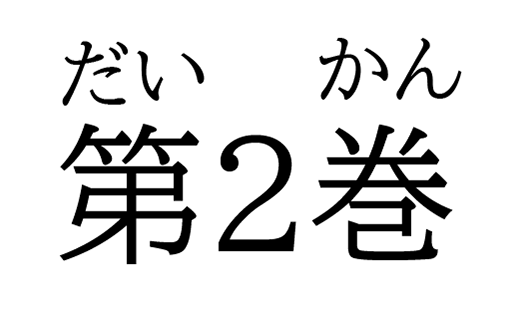
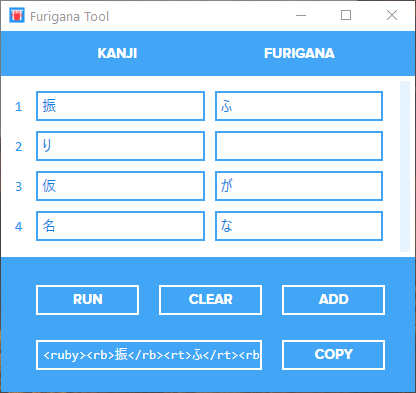
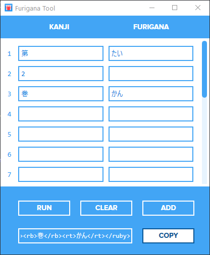

# Furigana Tool

**Furigana Tool** automates the process of writing HTML code for Furigana with *[ruby](https://developer.mozilla.org/en-US/docs/Web/HTML/Element/ruby)* syntax. It uses a modified version of the **[Gem](https://github.com/helephant/Gem)** library and adds a User Interface to it.

This tool was designed to work in conjunction with the **[HTML Table Generator](https://github.com/showmik/html-table-generator)** which I created for another project.

## The Ruby Syntax

> "A ruby annotation is a small extra text, attached to the main text to indicate the pronunciation or meaning of the corresponding characters. This kind of annotation is often used in Japanese publications." — W3Schools

Consider the word *Furigana* as an example:


To create something like this in HTML, we can write:

```
<ruby><rb>振</rb><rt>ふ</rt><rb>り</rb><rt></rt><rb>仮</rb><rt>が</rt><rb>名</rb><rt>な</rt></ruby>
```

And the result would be this:

> <ruby><rb>振</rb><rt>ふ</rt><rb>り</rb><rt></rt><rb>仮</rb><rt>が</rt><rb>名</rb><rt>な</rt></ruby>

<br/>

Or the word *Dai ni kan (Volume 2)*:



HTML:
```
<ruby><rb>第</rb><rt>たい</rt><rb>2</rb><rt></rt><rb>巻</rb><rt>かん</rt></ruby>
```
Resul:
> <ruby><rb>第</rb><rt>たい</rt><rb>2</rb><rt></rt><rb>巻</rb><rt>かん</rt></ruby>

## Using the Furigana Tool

As you can guess, writing HTML code every time I wanted to use Furigana was a headache for me. This tool made it a lot easier. Now I just need to enter the Kanji and Furigana, and it will generate the code for me.

<br/>

 


