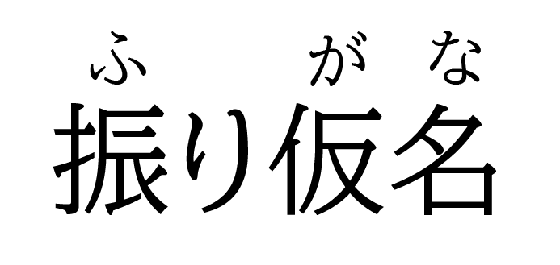

# Furigana Tool
**Furigana Tool** automates the process of writing HTML code for Furigana in *[ruby](https://developer.mozilla.org/en-US/docs/Web/HTML/Element/ruby)* syntax. It uses a modified version of the **[Gem](https://github.com/helephant/Gem)** library and adds a User Interface to it.

This tool was intended to be used along with the **[HTML Table Generator](https://github.com/showmik/html-table-generator)** for one of my projects.

## The Ruby Syntax

> "A ruby annotation is a small extra text, attached to the main text to indicate the pronunciation or meaning of the corresponding characters. This kind of annotation is often used in Japanese publications." — W3Schools

For examle:



To create some thing like this with html we can write:

```
<ruby><rb>振</rb><rt>ふ</rt><rb>り</rb><rt></rt><rb>仮</rb><rt>が</rt><rb>名</rb><rt>な</rt></ruby>
```

And the result would be this:
> <ruby><rb>振</rb><rt>ふ</rt><rb>り</rb><rt></rt><rb>仮</rb><rt>が</rt><rb>名</rb><rt>な</rt></ruby>
